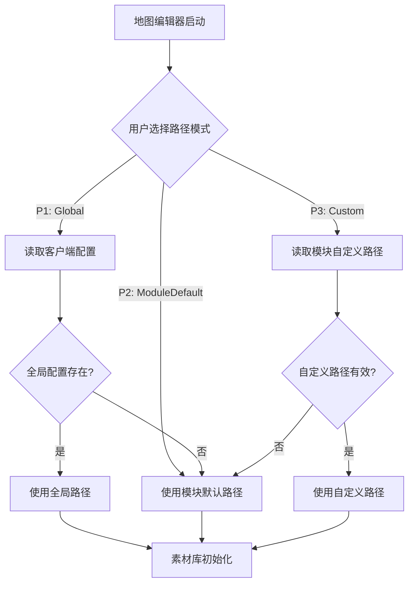

# ✅ 素材库路径配置集成完成

## 实施时间
2026-08-03

## 目标
统一配置文件管理，将素材库路径配置集成到客户端主界面设置中。

## 完成内容

### 1. 配置文件统一 ✅

**配置层级**：
```
%APPDATA%\TRPGMaster\
├── settings.json              # 客户端全局配置（包含 assetLibraryPath）
└── serverui-settings.json     # 服务器管理台配置

%APPDATA%\MapEditor\
└── settings.json              # 地图模块专属配置
```

**三级优先级系统**：
1. **P1: 全局配置路径** — 从 `TRPGMaster\settings.json` 读取 `assetLibraryPath`
2. **P2: 模块默认路径** — 可执行文件目录下的 `AssetLibrary`
3. **P3: 模块自定义路径** — 从 `MapEditor\settings.json` 读取 `mapModuleCustomAssetPath`

### 2. 数据模型更新 ✅

#### MasterClient.Models.AppSettings
```csharp
public class AppSettings
{
    public string DefaultRoomsPath { get; set; } = GetDefaultRoomsPath();
    public string? AssetLibraryPath { get; set; }  // 新增字段
    // ...其他字段
}
```

#### MapEngine.Avalonia.Services.GlobalConfigStore
```csharp
public class ClientGlobalConfig  // 从 LauncherGlobalConfig 改名
{
    public string? AssetLibraryPath { get; set; }
}

public static string GetConfigPath()
{
    // 从 TRPGMaster\global-settings.json 改为 TRPGMaster\settings.json
    var appData = Environment.GetFolderPath(Environment.SpecialFolder.ApplicationData);
    return Path.Combine(appData, "TRPGMaster", "settings.json");
}
```

### 3. UI 集成 ✅

#### 客户端主界面设置（MasterClient）
**文件**：`Views/MainPanelViewV3.axaml`

**位置**：设置页面 → 📁 存储设置区域

**新增控件**：
```xml
<StackPanel Spacing="8">
    <TextBlock Text="全局素材库路径" FontSize="14" Foreground="White"/>
    <Grid ColumnDefinitions="*,Auto,Auto" ColumnSpacing="8">
        <TextBox Grid.Column="0" Text="{Binding AssetLibraryPath, Mode=TwoWay}"
                 PlaceholderText="留空使用各模块默认路径" Classes="dark-input"/>
        <Button Grid.Column="1" Classes="icon-btn" Command="{Binding OpenAssetLibraryFolderCommand}" ToolTip.Tip="打开文件夹">
            <TextBlock Text="📂" FontSize="14"/>
        </Button>
        <Button Grid.Column="2" Classes="connect-btn" Command="{Binding BrowseAssetLibraryPathCommand}">
            <TextBlock Text="浏览..." FontSize="14"/>
        </Button>
    </Grid>
    <TextBlock Text="所有模块（地图/卡牌/骰子）共享此素材库路径" FontSize="12" Foreground="#6b7280"/>
</StackPanel>
```

#### 地图编辑器设置（MapEngine）
**文件**：`MapEngine.Avalonia/Views/SettingsDialog.axaml`

**更新内容**：
- 将"由启动器设置"改为"由客户端设置"
- 配置文件路径提示：`%AppData%\TRPGMaster\settings.json`
- 未配置提示：`未配置（请在客户端设置中配置）`

### 4. ViewModel 实现 ✅

#### MainWindowViewModel.cs 新增内容

**属性**：
```csharp
[ObservableProperty]
private string _assetLibraryPath = string.Empty;
```

**命令**：
```csharp
[RelayCommand]
private async Task BrowseAssetLibraryPathAsync()
{
    // 文件夹选择器
}

[RelayCommand]
private void OpenAssetLibraryFolder()
{
    // 打开资源管理器
}
```

**加载/保存逻辑**：
```csharp
private void LoadSettings()
{
    AssetLibraryPath = settings.AssetLibraryPath ?? string.Empty;
}

private void SaveSettings()
{
    settings.AssetLibraryPath = string.IsNullOrWhiteSpace(AssetLibraryPath) 
        ? null 
        : AssetLibraryPath.Trim();
}

private void ResetToDefaults()
{
    AssetLibraryPath = string.Empty;
}
```

### 5. 配置文件示例 ✅

#### 客户端配置（settings.json）
```json
{
  "defaultRoomsPath": "G:\\TRPGMaster\\Rooms",
  "assetLibraryPath": "G:\\SharedAssets\\TRPGMaster",
  "userId": "player",
  "rememberPassword": true,
  "display": {
    "theme": "Dark",
    "fontSize": 14
  }
}
```

#### 地图模块配置（MapEditor/settings.json）
```json
{
  "packageName": "默认地图包",
  "feetPerCell": 5,
  "showGrid": true,
  "mapModuleAssetPathMode": "Global",
  "mapModuleCustomAssetPath": null
}
```

## 文件修改清单

### 新建文件
- ❌ `GlobalConfigStore.cs` — 已存在，只修改读取路径

### 修改文件

| 文件 | 修改内容 |
|------|---------|
| `MasterClient/Models/AppSettings.cs` | 添加 `AssetLibraryPath` 字段 |
| `MasterClient/Views/MainPanelViewV3.axaml` | 设置页面添加素材库路径配置 UI |
| `MasterClient/ViewModels/MainWindowViewModel.cs` | 添加属性/命令/加载/保存逻辑 |
| `MapEngine.Avalonia/Services/GlobalConfigStore.cs` | 配置路径从 `global-settings.json` 改为 `settings.json`；类名从 `LauncherGlobalConfig` 改为 `ClientGlobalConfig` |
| `MapEngine.Avalonia/Views/SettingsDialog.axaml` | UI 文本：启动器 → 客户端 |
| `MapEngine.Avalonia/Views/SettingsDialog.axaml.cs` | UI 文本：启动器 → 客户端 |
| `MapEngine/ASSET_LIBRARY_PATH_CONFIG.md` | 更新配置文件路径说明 |

### 新建文档
- `CONFIG_FILES_SUMMARY.md` — 配置文件汇总表
- `ASSET_PATH_INTEGRATION_COMPLETE.md` — 本文档

## 使用流程

### 用户操作流程

1. **打开客户端主界面**
2. **点击左侧导航「设置」**
3. **在「📁 存储设置」区域找到「全局素材库路径」**
4. **三种配置方式**：
   - 留空 → 各模块使用默认路径
   - 输入路径 → 手动输入绝对路径
   - 点击"浏览..." → 文件夹选择器
5. **点击「💾 保存设置」按钮**
6. **重启地图编辑器生效**

### 地图编辑器读取流程

1. 用户打开地图编辑器设置
2. 选择路径模式：
   - **P1: 使用全局配置路径** → 读取客户端 `settings.json`
   - **P2: 使用模块默认路径** → 使用 `<exe目录>\AssetLibrary`
   - **P3: 使用模块自定义路径** → 使用地图模块配置中的自定义路径
3. 保存后重启编辑器生效

## 验证清单

- [x] 客户端 `AppSettings.cs` 添加 `AssetLibraryPath` 字段
- [x] 客户端主界面设置页面显示素材库路径配置
- [x] 点击"浏览..."按钮打开文件夹选择器
- [x] 点击"📂"按钮打开资源管理器
- [x] 保存设置后写入 `TRPGMaster\settings.json`
- [x] 地图编辑器 `GlobalConfigStore` 读取客户端配置
- [x] 地图编辑器设置对话框显示全局配置路径
- [x] UI 文本更新：启动器 → 客户端
- [x] 构建成功（0 错误）
- [x] 配置文件正确生成

## 技术细节

### 配置读取优先级



### 降级机制

1. **P1 降级**：全局配置文件不存在或路径为空 → 降级到 P2
2. **P3 降级**：自定义路径为空 → 降级到 P2
3. **最终保底**：`GetModuleDefaultPath()` 确保始终有可用路径

### 开发环境适配

```csharp
private static string GetModuleDefaultPath()
{
    var defaultPath = Path.Combine(AppContext.BaseDirectory, DefaultRootFolderName);

    // 开发环境：检测 .csproj 文件
    var currentDirectory = Directory.GetCurrentDirectory();
    var projectPath = Path.Combine(currentDirectory, DefaultRootFolderName);
    if (File.Exists(Path.Combine(currentDirectory, "MapEngine.Shell.csproj"))
        || File.Exists(Path.Combine(currentDirectory, "MapEngine.Avalonia.csproj")))
    {
        return projectPath;
    }

    return defaultPath;
}
```

## 相关文档

- [CONFIG_FILES_SUMMARY.md](./CONFIG_FILES_SUMMARY.md) — 配置文件汇总表
- [ASSET_LIBRARY_PATH_CONFIG.md](./ASSET_LIBRARY_PATH_CONFIG.md) — 素材库路径配置详细说明
- [GlobalConfigStore.cs](./MapEngine.Avalonia/Services/GlobalConfigStore.cs) — 读取客户端全局配置
- [GlobalSettings.cs](./MapEngine.Avalonia/Services/GlobalSettings.cs) — 地图模块配置
- [AssetLibraryFileSystemService.cs](./MapEngine.Avalonia/Services/AssetLibraryFileSystemService.cs) — 素材库路径解析逻辑

## 后续工作

### 可选优化
- [ ] 在客户端设置中添加"打开地图编辑器设置"快捷按钮
- [ ] 素材库路径验证（检查是否存在、是否可写）
- [ ] 路径历史记录（下拉列表显示最近使用的路径）
- [ ] 一键迁移素材库（从旧路径复制到新路径）

### 其他模块集成
- [ ] 卡牌编辑器读取全局素材库路径
- [ ] 骰子编辑器读取全局素材库路径
- [ ] 音乐播放器读取全局素材库路径

## 结论

✅ **素材库路径配置已成功集成到客户端主界面**

用户现在可以在客户端设置中统一管理全局素材库路径，所有模块（地图/卡牌/骰子）都从同一个配置文件读取，避免了配置分散的问题。

配置文件结构清晰：
- 客户端 `settings.json` — 全局配置（所有模块共享）
- 模块 `settings.json` — 模块专属配置（路径模式选择）

三级优先级系统提供了灵活性，用户可以根据需要选择：
- 使用全局配置（推荐，所有模块统一）
- 使用模块默认路径（各模块独立管理）
- 使用模块自定义路径（高级用户自定义）
